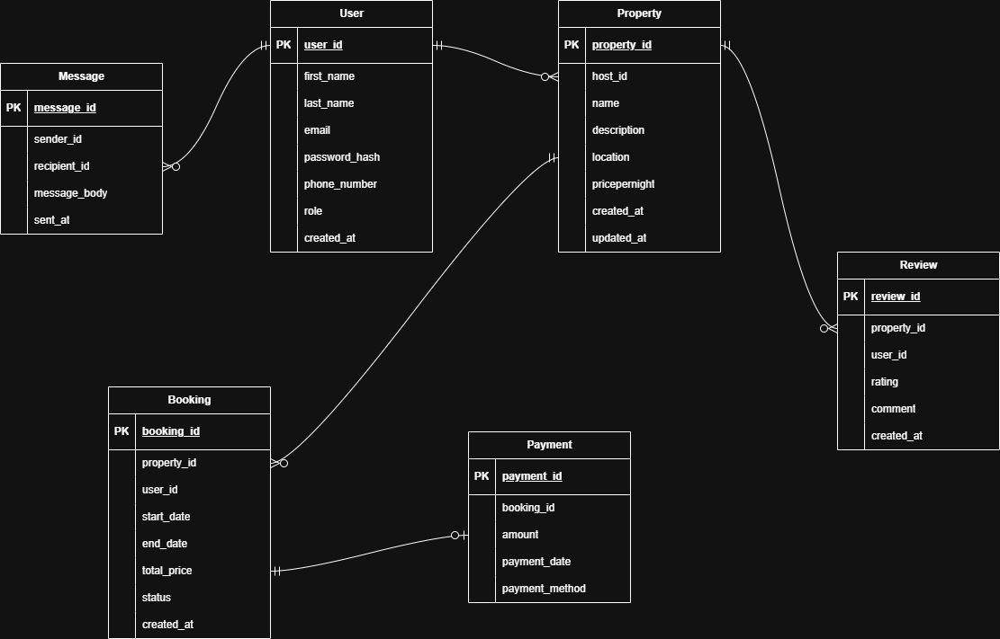

**Entities and Relationships:**

* A **User** can have many **Bookings** (one-to-many).
* A **Property** can have many **Bookings** (one-to-many).
* A **Booking** is associated with one **User** and one **Property** (many-to-one).
* A **Payment** is associated with one **Booking** (many-to-one).
* A **Review** is associated with one **Property** and one **User** (many-to-one).
* A **Message** is associated with one **User** as sender and one **User** as recipient (many-to-one).
